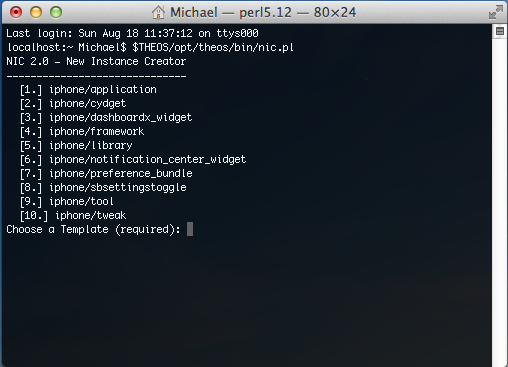

### To install theos just download this script . This will automatically install all necessary components of theos for you to start jailbreak development.

## INSTRUCTIONS

1.	Open Terminal

2.	Type chmod 775

3.	Drag the folder called TheosInstaller into the terminal window. (make sure that there is a space between 775 and /)

4.	Type installTheos.sh right next to TheosInstaller/

(What you have in Terminal should look similar to this: chmod 775 /Users/Michael/GitHub/TheosInstaller/installTheos.sh)

(That's assuming that the TheosInstaller folder is in /Users/Michael/GitHub)

5.	Now type cd

6.	Drag the TheosInstaller folder into the terminal again

7.	Hit enter on the keyboard

8.	Type ./installTheos.sh

6.	Hit enter on the keyboard, and enter your password when prompted.

7.	You now have a working copy of theos in your /opt directory!

8.	To start a new project, type $THEOS/opt/theos/bin/nic.pl

Happy Hacking!